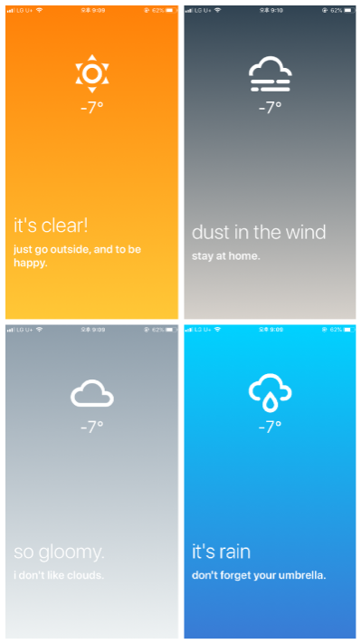

# get-weather 🌦

My frist react app!🎉 It shows you simple weather condition with beautiful gradation🌈 based on your location.

Visite my blog https://han.gl/aV6AM

## You can see..

- weather condition
- temperature(celsius)
- comment

## List of weather conditions

- Haze🌫
- Thunderstorm🌪
- Drizzle
- Rain🌧
- Snow❄
- Clear🌞
- Clouds☁
- Mist💧
- Dust

## Notice

- It is not completely builded app, so you need **expo app**(ios and android both) if you want to try it.
- I used **OpenWeather API** and some of weather conditions(not included in my condition list) are make error in this app.
- It needs your GPS.📍

## How to try

- First, download **expo app**(maybe you need to log in.).
- Scan this QRcode with your scan app📷.
- Then expo app shows you my **get-weather app**!

scan it!

or visite my expo https://expo.io/@soonitoon

## Screeshots

## Requirements

if you want to run this scrtips on your computer, you need some requirements.

1.**node.js** and **npm**

Linux: `sudo apt-get install nodejs` and `sudo apt-get install npm`

Windows: visite https://nodejs.org/ko/

2.**expo CLI**

Linux, Windows: `npm install -g expo-cli`
